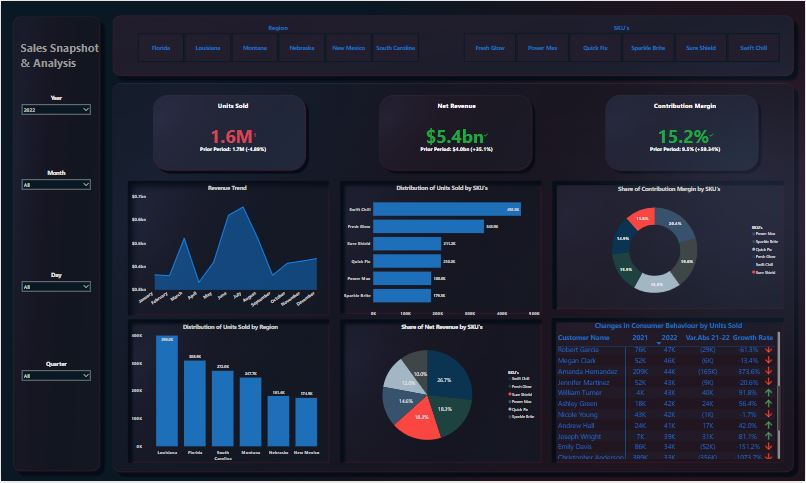

# Exploring Sales Analysis for a Beverage Company in the FMCG Sector

## Introduction
We operate in the fast-moving consumer goods (FMCG) sector, specializing in the production of beverages. As a prominent player in the country's beverage market, we have earned a reputation for delivering high-quality products and exceptional customer experiences. 
In our pursuit of sustained growth and market leadership, we recognize the importance of data-driven decision-making. To enhance our sales strategy, we have embarked on a mission to leverage real-time sales analysis for our diverse beverage portfolio. This analysis aims to empower us with actionable insights, enabling us to maximize sales growth, identify opportunities for improvement, and enhance overall sales performance.

## Data Sourcing
The dataset utilized for this analysis is a product of my own creation, reflecting the performance of the industry. Derived from my hands-on experience in the FMCG sector, I have drawn upon my experience in handling substantial datasets and distilling actionable insights. Through a blend of industry immersion and practical data analysis, I have meticulously constructed this dataset. It serves as the cornerstone of this analysis, delivering a reliable and knowledgeable viewpoint on the trends and dynamics within the beverage sector.

## Business Questions
We have highlighted key business questions we need you to help answer.
- How can we leverage real-time sales data to drive informed decisions and enhance performance tracking for our beverage portfolio, ensuring that we maximize sales growth and identify areas for improvement?
- Develop a comprehensive dashboard that provides real-time updates on sales performance, enabling swift responses to market trends and changes in consumer behavior.
- Analyze current sales data against historical benchmarks to uncover trends, patterns, and deviations, allowing us to identify factors influencing sales fluctuations.
- Examine the sales performance of individual SKUs within our beverage portfolio to understand their contribution to overall revenue and identify potential growth opportunities.

By implementing real-time sales analysis and addressing the outlined questions, we anticipate the following outcomes:
- Improved agility in decision-making through access to current sales insights.
- Enhanced portfolio optimization based on SKU-specific performance data.
- Identification of growth opportunities and strategies to boost underperforming SKUs.
- Greater alignment of sales strategies with consumer preferences and market trends.
  
This underscores our commitment to data-driven excellence and our aspiration to maintain our position as a market leader in the beverage industry. By harnessing the power of real-time sales analysis, we are poised to navigate the dynamic market landscape with greater precision and strategic advantage.

## Data Transformation and Cleaning
Setting my course, I initiated the process by importing the Excel data file into Power BI. Within the realm of Power Query, I embarked on a meticulous transformation journey. The dataset, spanning 7023 rows, stood devoid of any error values—a testament to the precision of my approach. My paramount focus was to impeccably reflect the headers and data types, underlining my dedication to accuracy. As I navigated through this endeavor, I granted special attention to the creation of novel columns denoting year, month, quarter, and day.

Much akin to an artisan sculpting raw materials into exquisite art, I infused my actions with a skilled touch. Employing calculated measures and harnessing the prowess of time intelligence formulas, I conscientiously crafted key metrics destined for the realm of visualization. In the culmination of this voyage, I meticulously arranged all elements, ensuring formats harmonized seamlessly, and the stage was set for an impeccable visualization.

## Dashboard

## Report and Analysis
Leveraging real-time sales data should form the foundation of strategic and well-informed decision-making. A comprehensive and detailed analysis, grounded in this foundation, drives informed choices, facilitates improvements in areas of weakness, harnesses strengths for growth, and presents an accurate portrayal of progress.

By tapping into real-time data, we uncover a wealth of insights that illuminate our path forward. This array of insights advances our comprehension of consumer behavior and equips us to swiftly adapt to shifts in market trends. This triggers an immediate response, enabling us to efficiently allocate resources and cater to evolving demands.

In the context of the revenue trends for the year 2022 under scrutiny, a precise depiction of sales performance unfolds, marked by revenue fluctuations throughout the year. July stands as the pinnacle of our sales growth, while April records the lowest sales. Further scrutiny can delve into explaining the peaks and troughs in revenue by studying consumer behaviors pertaining to sold SKUs and regional trends, thus identifying regions responsible for declines or growth. These inquiries find answers through the distribution of units sold by region, the share of net revenue by SKUs, and a more intricate breakdown of shifts in consumer behavior through units sold.

With real-time sales data readily available, we erect a vigilant watchtower over our beverage portfolio. Here, we not only observe the rise and fall of sales but also discern patterns that may have otherwise eluded us. These patterns extend to granular analyses, unraveling each level of SKU's revenue contribution, contribution margin, and the optimization of performance based on each individual customer's behaviors.

An equitable distribution of revenue is evident across all six brands within our portfolio. Notably, Swift Chill emerges as the dominant revenue generator with a share of 26.7%, closely trailed by Sure Shield and Fresh Glow, each contributing 18.3%. In contrast, Sparkle Bright stands as the least revenue contributor with a 10% share. A deeper examination of Sparkle Bright unveils a substantial decline in consumer spending. Instances include Robert Garcia, experiencing a drastic 250.9% drop in his previous year's purchase, plummeting from 16,000 units in 2021 to 5,000 units in 2022. Similarly, David Wilson's purchases witnessed a staggering plummet of 895.6%, plummeting from 46,000 units to 5,000 units. This decline in customer spending beckons the question, "What factors are accountable for such sharp declines, and how can we address them to restore positive growth?"

To address this quandary, we must delve into the underlying factors. Among these, a notable factor could be a shift in consumer preferences and trends, prompting customers to explore brands more aligned with their current inclinations. Additionally, shifts in perception regarding Sparkle Bright's quality, value, or relevance might influence customers to opt for alternative choices. Intense competition from similar market products could also divert customers away from Sparkle Bright, particularly if competitors offer more alluring features or pricing. Economic downturns and financial changes could also contribute to this phenomenon. Moreover, attention should be directed towards marketing strategies, as a lack of novel features, updates, or innovations for Sparkle Bright could diminish customer excitement and perceived value.

Each decision propelled by real-time insights holds the potential to chart our sales trajectory. The question challenges us how do we steer our ship to maximize sales growth? Equipped with real-time data, we no longer navigate blindly. Instead, we harness trends, seize opportunities, and pivot away from pitfalls.

## Conclusion
It is apparent that harnessing real-time sales data provides a significant advantage for our growth and prosperity. This practice extends a horizon from our vulnerabilities to our strengths, concentrating on enhancing capabilities where we are less robust. Through our interactive dashboard a mere snap of your fingers transforms raw sales data into the insights you seek.

As we delve into real-time insights, we cast light on our route, armed with a profound grasp of consumer behavior and the ebb and flow of the market. We unveiled the intricate details shaping our sales landscape. Through meticulous examination, we untangled patterns, scrutinized SKU contributions, and identified regions ripe for potential. The distribution of revenue across our portfolio brands presents a balanced picture, yet it also focuses a spotlight on Sparkle Bright as a pivotal area for rejuvenation.

The remarkable drop in consumer spending for Sparkle Bright directs our attention toward addressing the multifaceted factors at play. The shift in consumer preferences, competitive pressures, and economic fluctuations are all pivotal elements that necessitate strategic intervention. Marketing strategies, innovation approaches, and the perception of value all require recalibration to reignite customer engagement.

In summary, the voyage from data to insight, from analysis to action, stands as a testament to our unwavering commitment to excellence. We stand poised not only to maximize sales growth but also to redefine the narrative of triumph for our beverage portfolio.

## Recommendation
Armed with the insights garnered from our analysis, here are actionable recommendations to address the challenges and seize the opportunities highlighted:
- Intensify efforts to enhance Sparkle Bright's value proposition. Innovate by introducing new features, packaging, or even exploring potential collaborations to rekindle consumer interest.
- Reimagine Sparkle Bright's marketing strategy. Tailor campaigns to highlight unique attributes and resonate with evolving consumer preferences. Embrace digital platforms and personalized approaches to increase engagement.
- Deepen our understanding of consumer behavior. Conduct in-depth surveys, analyze feedback, and segment customers based on preferences to inform product improvements and better meet their needs.
- Investigate competitors' strengths and weaknesses. Utilize this intelligence to refine Sparkle Bright's positioning, leveraging differentiators that resonate with our target audience.
- Expand the integration of real-time sales data across all brands. Leverage data analytics to predict trends, optimize inventory, and tailor strategies that harness the power of actionable insights.
- Foster a sense of connection and community around the Sparkle Bright brand. Engage customers through loyalty programs, exclusive offers, and interactive content that resonates with their aspirations.
- Explore partnerships that align with Sparkle Bright's identity and values. Collaborations can introduce fresh perspectives, enhance credibility, and attract new customer segments.
- Establish a feedback loop that consistently gathers consumer insights. Regularly assess product performance, iterate on improvements, and refine strategies based on real-time feedback.

**_By embracing these recommendations, we pave the way for tangible implementation, marking a strategic shift that aims to realign our business for enhanced prosperity and enduring success_**

